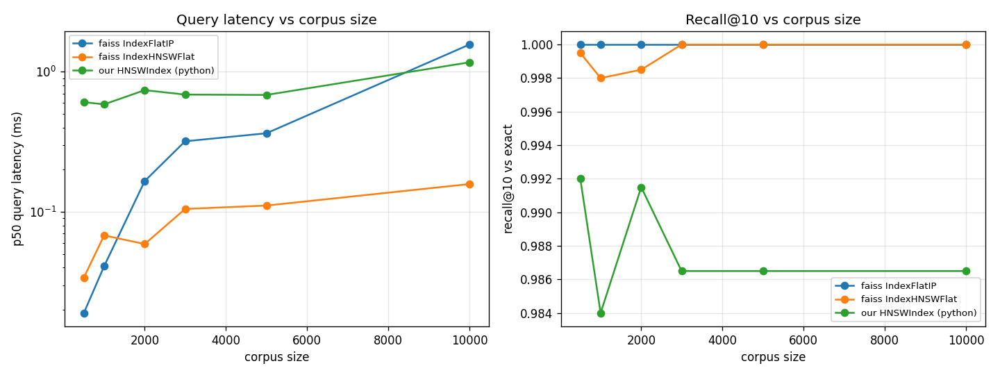

# HNSW vs Faiss — profile on the real paper corpus

Hand-written `app/retrieval/hnsw.py` vs Faiss, on 2995 real arXiv paper embeddings (384-dim, fine-tuned encoder); sizes beyond 2995 padded with synthetic unit vectors. Recall is vs exact brute force. Single-query latency (the app retrieves one query at a time).

**Headline:** the from-scratch HNSW reaches **~0.99 recall@10** (vs Faiss `IndexHNSWFlat`'s ~1.0) — i.e. it is *algorithmically correct*. It is **~6–7× slower per query** than Faiss (pure-Python vs C++/SIMD) and much slower to build, yet it is **sublinear**: at 10k vectors it already beats *exact* brute force. So: correct algorithm, Faiss wins on speed, and the Python index still earns the ANN advantage at scale.

## Corpus size 500 (real)

| Index | Build (s) | p50 (ms) | p95 (ms) | Recall@10 |
|-------|-----------|----------|----------|-----------|
| faiss IndexFlatIP | 0.009 | 0.019 | 0.05 | 1.0000 |
| faiss IndexHNSWFlat | 0.051 | 0.034 | 0.111 | 0.9995 |
| our HNSWIndex (python) | 0.831 | 0.607 | 1.93 | 0.9920 |

## Corpus size 1000 (real)

| Index | Build (s) | p50 (ms) | p95 (ms) | Recall@10 |
|-------|-----------|----------|----------|-----------|
| faiss IndexFlatIP | 0.0 | 0.041 | 0.088 | 1.0000 |
| faiss IndexHNSWFlat | 0.054 | 0.068 | 0.109 | 0.9980 |
| our HNSWIndex (python) | 1.959 | 0.585 | 0.996 | 0.9840 |

## Corpus size 2000 (real)

| Index | Build (s) | p50 (ms) | p95 (ms) | Recall@10 |
|-------|-----------|----------|----------|-----------|
| faiss IndexFlatIP | 0.001 | 0.166 | 0.7 | 1.0000 |
| faiss IndexHNSWFlat | 0.097 | 0.059 | 0.106 | 0.9985 |
| our HNSWIndex (python) | 4.8 | 0.739 | 1.477 | 0.9915 |

## Corpus size 2995 (real)

| Index | Build (s) | p50 (ms) | p95 (ms) | Recall@10 |
|-------|-----------|----------|----------|-----------|
| faiss IndexFlatIP | 0.001 | 0.319 | 1.024 | 1.0000 |
| faiss IndexHNSWFlat | 0.191 | 0.105 | 0.325 | 1.0000 |
| our HNSWIndex (python) | 11.622 | 0.687 | 1.742 | 0.9865 |

## Corpus size 5000 (real+2005 synthetic)

| Index | Build (s) | p50 (ms) | p95 (ms) | Recall@10 |
|-------|-----------|----------|----------|-----------|
| faiss IndexFlatIP | 0.004 | 0.364 | 0.948 | 1.0000 |
| faiss IndexHNSWFlat | 0.245 | 0.111 | 0.421 | 1.0000 |
| our HNSWIndex (python) | 16.553 | 0.683 | 1.565 | 0.9865 |

## Corpus size 10000 (real+7005 synthetic)

| Index | Build (s) | p50 (ms) | p95 (ms) | Recall@10 |
|-------|-----------|----------|----------|-----------|
| faiss IndexFlatIP | 0.004 | 1.563 | 4.619 | 1.0000 |
| faiss IndexHNSWFlat | 1.82 | 0.158 | 0.717 | 1.0000 |
| our HNSWIndex (python) | 38.743 | 1.167 | 2.681 | 0.9865 |

## Reading this

- **Recall:** the hand-written HNSW should track Faiss `IndexHNSWFlat` closely (same algorithm) and both stay below exact only marginally.
- **Latency:** Faiss is C++/SIMD; the pure-Python index pays per-hop interpreter and heap overhead, so it is much slower per query. That gap is the honest reason Faiss is the production ANN choice while `HNSWIndex` documents the algorithm (and is wired in only above a candidate-pool threshold, where exact is cheap anyway). The flat exact index is the latency floor at these sizes.

Reproduce: `python benchmarks/hnsw_vs_faiss.py`
