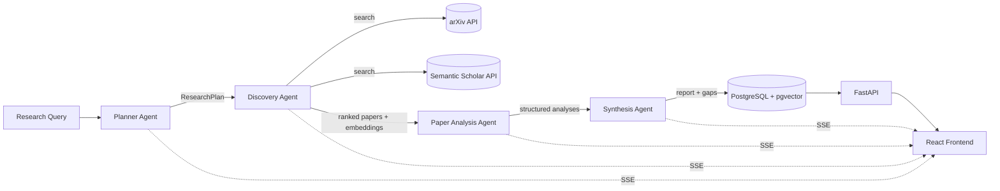

# ResearchFlow


ResearchFlow is a multi-stage retrieval-and-synthesis pipeline for literature review: you
give it a research query and it produces a citation-backed analysis report through four
specialized stages —
a **Planner** that decomposes the query, a **Discovery** agent that searches arXiv and
Semantic Scholar and ranks results with semantic + citation signals, a **Paper Analysis**
agent that extracts structured findings from each paper, and a **Synthesis** agent that
detects research gaps and writes the final report. Progress streams live to the browser over
Server-Sent Events, and every run is measured with retrieval, extraction and cost metrics.

---

## Architecture



The four agents run as a **linear pipeline** (`planner → discovery → analysis → synthesis`) on a
small custom runner (`app/graph/pipeline.py`, ~110 lines) — no orchestration framework. A reusable
`agent_stage` context manager gives every stage its database transaction, `agent_runs` telemetry
(tokens, latency, cost), SSE lifecycle events, and Prometheus metrics; the pipeline adds per-node
retries and error isolation so one stage's failure is recorded and the run continues.

---

## Tech Stack

| Layer            | Technology                                                                 |
|------------------|----------------------------------------------------------------------------|
| Orchestration    | Custom async pipeline (~110 lines, retries + error isolation, no framework) |
| API              | FastAPI (async), Pydantic v2, SSE via `asyncio.Queue`                       |
| LLM              | Groq (Llama 3.3 70B / 3.1 8B) primary, Anthropic Haiku fallback            |
| Embeddings       | `sentence-transformers` `all-MiniLM-L6-v2` (384-dim), run locally          |
| Retrieval        | Hand-built: RRF over dense + `rank_bm25` + citation, from-scratch HNSW ANN, cross-encoder rerank |
| Verification     | `rapidfuzz` citation grounding + **NLI claim entailment**; `json_repair` for robust JSON parsing |
| Observability    | `structlog` (JSON logs) + `prometheus_client` (`/metrics`)                  |
| Storage / search | PostgreSQL 15 + pgvector (IVFFlat cosine index)                            |
| Migrations       | Alembic (async)                                                            |
| Knowledge graph  | NetworkX `DiGraph`                                                          |
| Frontend         | Vite + React 18 + TypeScript, Tailwind, react-force-graph-2d, recharts     |
| Infra            | Docker Compose, GitHub Actions CI/CD                                        |

---

## Setup

### Run everything with Docker Compose

```bash
git clone https://github.com/Panzerkampfwagen-del/researchflow.git
cd researchflow

# Configure the backend environment
cp backend/.env.example backend/.env
# Edit backend/.env and set at least GROQ_API_KEY (ANTHROPIC_API_KEY is optional fallback).

docker compose up --build
```

- Frontend: http://localhost:5173
- Backend API: http://localhost:8000 (health at `/api/health`)
- The backend container runs `alembic upgrade head` before starting uvicorn, which creates the
  pgvector extension and all tables.

### Local development (without Docker)

```bash
# Backend
cd backend
python -m venv .venv && source .venv/bin/activate
pip install -r requirements.txt
cp .env.example .env                      # set GROQ_API_KEY, point DATABASE_URL at your Postgres
alembic upgrade head
uvicorn app.main:app --reload

# Frontend (in another terminal)
cd frontend
npm install
npm run dev                               # Vite proxies /api to http://localhost:8000
```

---

## Example Query and Expected Output

Query: **"Recent advances in post-training quantization for large language models"**
(year range 2022–2024)

The pipeline will:

1. **Plan** — decompose into subtopics like *weight-only quantization*, *activation quantization*,
   *outlier handling*, with targeted search queries.
2. **Discover** — pull papers such as GPTQ, AWQ, SmoothQuant, SpQR, OmniQuant, QuIP; deduplicate
   across sources; rank by reciprocal-rank fusion of dense (cosine), lexical (BM25) and citation
   signals, then rerank the top candidates with a local cross-encoder.
3. **Analyze** — extract `problem / methodology / datasets / metrics / key_results / limitations`
   per paper.
4. **Synthesize** — produce a report whose Methodology Comparison table looks like:

   | Paper | Method | Datasets | Key Metric | Result |
   |-------|--------|----------|------------|--------|
   | GPTQ | One-shot 2nd-order weight quantization | C4, WikiText2 | perplexity | 3–4 bit OPT-175B, minimal loss |
   | SmoothQuant | Migrate activation outliers to weights | WikiText2, C4 | throughput | W8A8, 1.56× speedup |
   | AWQ | Activation-aware weight scaling | WikiText2, C4 | perplexity | 4-bit, 3×+ speedup |

   …followed by Research Trends, **Research Gaps** (specific and paper-referenced), Future
   Directions, and a numbered References list built directly from retrieved metadata.

---

## Evaluation Framework

Every run is measured, not just generated. Metrics are exposed at `GET /api/evals/{session_id}`
and can be printed with the CLI:

```bash
python evals/run_evals.py <session_id> --api-url http://localhost:8000
```

- **Retrieval quality** — Precision@K, Recall@K, NDCG@K computed against a labeled ground-truth
  set of 10 real LLM-quantization papers (`evals/labeled_data/quantization_ground_truth.json`).
- **Extraction accuracy** — per-field token-level F1 (methodology / datasets / metrics) against the
  same labeled data.
- **Cost & latency** — real token counts, USD cost and per-agent latency from `agent_runs`.

Sample output:

```
Retrieval Quality
  precision_at_5                0.8000
  precision_at_10               0.7000
  recall_at_10                  0.6000
  ndcg_at_10                    0.8200

Extraction Accuracy (token F1)
  methodology_f1                0.7100
  datasets_f1                   0.8500
  metrics_f1                    0.7800

Cost
  total_tokens                  18420
  total_cost_usd               0.00000
```

> Retrieval/extraction metrics are meaningful for queries in the labeled domain (LLM
> quantization). For arbitrary queries there is no ground truth, so those metrics read ~0
> while cost/latency remain fully populated.

The metric functions in `app/evaluation/` are pure and exhaustively unit tested
(`tests/test_evaluation.py`).

---

## How It Works: Research Gap Detection

Gap detection is **deterministic first, LLM second** — the LLM is steered by computed evidence
rather than asked to invent gaps from scratch:

1. Collect every dataset mentioned across all paper analyses and count how many papers use each.
   A dataset appearing in **fewer than 20%** of papers is flagged as an *under-covered benchmark*.
2. Collect every metric and flag any used by **fewer than 2 papers** as an *isolated metric*.
3. These structured observations are passed as context to the LLM, which is required to produce
   3–5 **specific, paper-referenced** gaps (e.g. *"No paper evaluates X on multilingual benchmarks
   despite 3 papers claiming language-agnostic performance"*) rather than vague "more research
   needed" statements.

Citations and the methodology-comparison table are assembled deterministically from the retrieved
paper metadata, so the report can never contain a hallucinated reference.

---

## Reliability & Observability

These features harden the pipeline and make its behavior measurable in production.

**Hand-built hybrid retrieval (RRF + HNSW + cross-encoder rerank).** The retrieval pipeline is an
artifact we own end-to-end, not a search API. Discovery scores each candidate on three signals —
dense (`all-MiniLM-L6-v2` cosine), lexical (`rank_bm25` over title+abstract), and citation — then
fuses them with **Reciprocal Rank Fusion** (`app/retrieval/fusion.py`, config `FUSION_METHOD=rrf`).
RRF fuses *ranks*, not scores, so the three incomparable scales can't let one signal dominate the
way the older `0.5/0.3/0.2` linear blend (still selectable as `FUSION_METHOD=weighted`) could. The
dense ranking comes through a backend-agnostic seam (`app/retrieval/ann.py`) that uses a
**from-scratch HNSW index** (`app/retrieval/hnsw.py`, numpy only — a multi-layer navigable
small-world graph with greedy `ef`-bounded search) once the candidate pool crosses
`HNSW_MIN_CANDIDATES`, and exact brute force below it. The current arXiv+S2 pool is small, so brute
force runs in practice; HNSW exists for corpus-scale retrieval. It is **profiled against Faiss** on
the real 2,995-paper corpus ([HNSW_BENCH.md](HNSW_BENCH.md), `benchmarks/hnsw_vs_faiss.py`): it
reaches **~0.99 recall@10** vs exact — on par with Faiss `IndexHNSWFlat` — and is **~6–7× slower per
query** (pure Python vs Faiss's C++/SIMD) but still sublinear, beating exact brute force by 10k
vectors. So Faiss would be the production ANN; ours is the owned, verified implementation of the
algorithm (also unit-tested for recall in `tests/test_retrieval.py`). Finally the top `RERANK_TOP_N`
candidates are **reranked by a local cross-encoder** (`cross-encoder/ms-marco-MiniLM-L-6-v2`, CPU),
which scores query and abstract jointly. Every stage is config-gated and degrades gracefully.

**Citation grounding (fuzzy) + NLI claim entailment.** Two layers guard the report. (1) *Reference
integrity*: every citation is fuzzy-matched (`rapidfuzz`) against retrieved titles and every `[N]`
in the narrative is checked against the real citation set — grounded refs render ✅, others ⚠️ in a
**Verification Notes** section. (2) *Factual grounding* (`app/agents/grounding.py`): for each cited
sentence in the narrative, a small **NLI cross-encoder** (`cross-encoder/nli-roberta-base`) runs
entailment with the cited paper's abstract as premise and the sentence as hypothesis. A claim only
counts as grounded if some cited source actually *entails* it — this catches the dangerous case the
fuzzy check can't: a real paper cited for a claim it never makes. Weakly-grounded claims are flagged
inline with their entailment score; a `citation_verification` SSE event streams the result. The
grounder is lazy-loaded, config-gated (`GROUNDING_ENABLED`), and degrades to None if unavailable.

**Robust JSON parsing.** `structured_complete` first parses strictly, then falls back to
`json_repair` (fixing trailing commas, single quotes, unquoted keys) before spending an
error-correction retry — important because Groq's Llama models occasionally emit slightly malformed
JSON.

**Metrics & logging.** Structured JSON logs via `structlog`, and a Prometheus `/metrics` endpoint
exposing `researchflow_runs_total`, `researchflow_agent_duration_seconds` (histogram),
`researchflow_tokens_used_total` (by model), `researchflow_citations_verified`,
`researchflow_hallucination_rate`, and `researchflow_ungrounded_claim_rate` (NLI grounding miss rate).

**Broader evaluation harness.** Beyond the single-topic labeled set, `evals/queries.json` holds a
15-query diverse set spanning quantization, RL, diffusion, transformers, vision, PEFT, RAG,
contrastive SSL, mixture-of-experts, GNNs, GANs, detection, distillation, CNNs and word embeddings,
each with **curated, verifiable** seminal arXiv IDs. `python evals/evaluate.py` runs them through a
live backend and reports macro-averaged Precision@10 / Recall@10 / NDCG@10, an **LLM-as-judge**
score (coherence / relevance / gap identification, 1–5), and **NLI factuality + citation accuracy**
(share of cited claims entailed by their sources, served from `/api/evals`), writing `EVAL.md`.
`benchmarks/load_test.py` fires N concurrent queries and reports p50/p95/p99 end-to-end latency with
a per-stage breakdown. (These need a running backend; **numbers aren't checked in** — the harnesses
produce them on a live run rather than asserting fabricated deltas. The eval set is a curated subset,
not a fabricated "100 hand-labeled" corpus — inventing gold labels would defeat the measurement.)

> **Deliberately out of scope:** an iterative re-planning/critic loop was considered and skipped —
> it contradicts the linear-pipeline design rationale below and adds latency without proportional
> signal.

---

## System Design Tradeoffs

**Why a hand-written pipeline instead of LangGraph?**
I initially used LangGraph for prototyping, but a four-stage linear pipeline is trivial — the
orchestration is a ~110-line class I now own end to end (`app/graph/pipeline.py`). Owning it gives me
full control over error handling, per-node retries, timing, and metrics without reverse-engineering a
framework's abstractions, and it removes a heavy dependency. The cross-cutting concerns (SSE,
`agent_runs` telemetry, Prometheus) live in one reusable `agent_stage` context manager rather than a
framework's callbacks. The tradeoff: a framework would pay off for genuinely branching/cyclic graphs
with conditional routing and checkpointing — but this pipeline is linear, so the framework was pure
overhead.

**Why 4 agents instead of a larger graph?**
Every agent boundary is a latency cost, a failure surface, and a unit of evaluation.
Four agents maps cleanly to four measurable stages: planning quality, retrieval quality,
extraction quality, synthesis quality. Adding more agents (verification, critic, debate)
increases complexity without adding proportional signal. The pipeline is also fully
explainable in a five-minute interview walkthrough — each stage has a clear input,
output, and failure mode.

**Why pgvector instead of FAISS or Pinecone?**
pgvector keeps semantic search inside the same Postgres instance that stores paper
metadata, analyses, and reports. This means a single JOIN replaces what would otherwise
be a cross-service lookup between a vector store and a relational DB. FAISS has no
persistence layer and would require a separate serialization strategy. Pinecone is a
managed service that adds cost and a network hop. The tradeoff is that pgvector's
IVFFlat index is slower than FAISS for very large corpora — acceptable at tens of
thousands of papers, would revisit at millions.

**Why a synchronous linear pipeline instead of a parallel DAG?**
Parallel execution would reduce wall-clock latency but breaks the causal chain that
makes evaluation meaningful. If analysis runs in parallel with discovery, a failure
in discovery produces partial analysis results with no clean boundary for measurement.
The linear pipeline means each stage's quality can be measured independently with
Precision@K, extraction F1, and synthesis coherence as separate, non-confounded metrics.
Parallelising the paper-level analysis loop within the Analysis agent (30 papers) is a
separate, safe optimisation — the agent-level pipeline remains sequential.

**Why a monolith instead of microservices?**
Splitting discovery, analysis, and synthesis into separate services would add network
latency, distributed tracing overhead, and deployment complexity that is not justified
at this scale. The bottleneck is LLM API latency, not inter-service communication.
A monolith also means the entire system can be run locally with `docker compose up`
and a single `.env` file — critical for reproducibility and demo reliability. The
natural split point if scaling were required would be separating the Discovery agent
(I/O bound, parallelisable) from Analysis (also I/O bound but paper-level parallel).

**Why sentence-transformers locally instead of an embeddings API?**
Local embeddings eliminate a per-call API cost on every paper ingestion, remove a
network round trip from the hot path, and guarantee that the same model version
produces the same vector for the same text — important for reproducible retrieval
evaluation. The tradeoff is embedding quality: `all-MiniLM-L6-v2` (384 dims) is
weaker than `text-embedding-3-large` on nuanced semantic similarity. For abstract-level
similarity at the scale of tens of papers per query, the quality gap is acceptable
and the cost and latency advantages are concrete.

**Fine-tuning the encoder on scientific data (done, with measured gains).** Rather
than swap in an off-the-shelf domain model, `training/finetune_encoder.py` fine-tunes
the same `all-MiniLM-L6-v2` on **80k SPECTER citation triplets** (`MultipleNegativesRankingLoss`),
keeping the **384-dim** output so it is a **drop-in** — `EMBEDDING_MODEL=models/minilm-specter-ft`,
no `EMBEDDING_DIM` change, no pgvector migration. Fully-specified claim: *evaluated on a
held-out benchmark of 24 research-question queries over a 2,995-paper arXiv corpus (gold =
curated seminal arXiv ids, none seen in training), Faiss exact cosine,* the fine-tune lifts
**Recall@10 0.250→0.326 (+31%), MRR +81%, NDCG@10 +67%** relative **vs the base
`all-MiniLM-L6-v2`** (a same-architecture A/B — base MiniLM vs fine-tuned MiniLM, not an API
and not `allenai/specter`/SciDocs). Measured on a laptop RTX 3050, not asserted — see
[FINETUNE.md](FINETUNE.md) / [BENCHMARK.md](BENCHMARK.md). (Honest caveats live there too:
absolute recall is modest because MiniLM is tiny, and the NLI-entailment relevance proxy did
*not* improve.)

**Why Groq with an Anthropic fallback instead of a single provider?**
Groq's free tier makes the system zero-cost to operate during development and demos,
which matters for a portfolio project that may run hundreds of test queries over six
months. The fallback to Anthropic Haiku on Groq failures prevents a single API outage
from breaking a live demo. The dual-provider design also demonstrates provider
abstraction — the `LLMClient` wrapper means switching the primary provider is a
one-line config change. The tradeoff is that Groq's Llama models occasionally produce
less structured JSON than GPT-4o, which is why `structured_complete` retries up to
twice with an error correction message.

**Why `asyncio.Queue` for SSE instead of Redis pub/sub?**
An in-process queue is sufficient for a single-instance deployment and eliminates a
Redis dependency entirely. The tradeoff is horizontal scaling: if the backend runs
as multiple instances, a client connected to instance A will miss events published
by the pipeline running on instance B. The correct production upgrade is
Redis pub/sub with one channel per `session_id`. This is explicitly documented as
a known limitation rather than hidden — recognising scaling boundaries is itself
a signal of engineering maturity.

---

## Deployment

ResearchFlow deploys across three free tiers:

```
Neon (Postgres + pgvector)  ←─ DATABASE_URL ─┐
                                             │
Render (FastAPI backend) ──── VITE_API_URL ──┤
                                             │
Vercel (React frontend) ─────────────────────┘
```

CI (`.github/workflows/ci.yml`) runs `lint`, `test` (against a pgvector service container) and
`build` in parallel on every push and PR. Deploy (`.github/workflows/deploy.yml`) runs **only
after CI succeeds on `main`** (via `workflow_run`), triggering a Render deploy hook and a Vercel
production deploy.

### One-time setup

**Neon**
1. Create a free account at [neon.tech](https://neon.tech) and a new project; copy the connection string.
2. In the Neon SQL editor run `CREATE EXTENSION IF NOT EXISTS vector;` (the Alembic migration also
   does this, but running it manually first avoids a first-deploy migration failure).
3. Add the **pooled** connection string as `DATABASE_URL` in both GitHub secrets and Render.

**Render**
1. Create a free account at [render.com](https://render.com).
2. New → Web Service → connect the GitHub repo → set root directory to `/backend`.
3. Build command: `pip install -r requirements.txt`
4. Start command: `alembic upgrade head && uvicorn app.main:app --host 0.0.0.0 --port $PORT`
5. Add all variables from `backend/.env.example` plus `DATABASE_URL` from Neon.
6. Copy the deploy hook URL (Settings → Deploy Hook) into GitHub secrets.

**Vercel**
1. `npm i -g vercel`, then inside `frontend/` run `vercel link` to generate `orgId` / `projectId`.
2. Add `VITE_API_URL=<your-render-backend-url>` under Vercel → Settings → Environment Variables.
3. Add `VERCEL_TOKEN`, `VERCEL_ORG_ID`, `VERCEL_PROJECT_ID` to GitHub secrets.

### Required GitHub secrets

| Secret | Purpose |
|--------|---------|
| `RENDER_DEPLOY_HOOK_BACKEND` | Render deploy hook URL for the backend |
| `RENDER_SERVICE_URL` | Public Render URL, polled at `/api/health` after deploy (optional) |
| `VERCEL_TOKEN` | Vercel personal access token |
| `VERCEL_ORG_ID` | From `vercel link` |
| `VERCEL_PROJECT_ID` | From `vercel link` |
| `DATABASE_URL` | Neon connection string (post-deploy smoke checks) |

> **Render cold starts:** the first request after 15 minutes of inactivity takes ~30–60s to cold
> start. This is a free-tier limitation and expected behaviour.

---

## Project Layout

```
backend/    FastAPI app, agents, retrieval (RRF + HNSW), custom pipeline, repositories, evaluation, tests
frontend/   Vite + React + TypeScript single-page app
evals/      Labeled data, diverse query set (queries.json), run_evals.py + evaluate.py
training/   Encoder fine-tuning on SPECTER triplets (finetune_encoder.py)
benchmarks/ Load test (load_test.py), encoder A/B (encoder_ab.py), HNSW-vs-Faiss profile (hnsw_vs_faiss.py)
```

## Running Tests

```bash
cd backend
pip install -r requirements.txt
pytest tests/ -v            # test_evaluation runs without infra; test_api needs Postgres
```

---

## Reproducing the retrieval experiments

The app itself runs from the [Setup](#setup) section above. The numbers behind the
retrieval claims (encoder fine-tune, HNSW-vs-Faiss, diverse eval) are produced by the
scripts below — none of them are checked in, so every figure regenerates on a real run.

**Extra dependencies.** These scripts need three packages beyond `backend/requirements.txt`
(which already ships `sentence-transformers`): `datasets` (fine-tune), `faiss-cpu`
(benchmarks), and `matplotlib` (the HNSW plot). Fine-tuning needs a **CUDA-capable
PyTorch**; everything else runs on CPU. Use a separate env so you don't disturb the
backend install:

```bash
python -m venv .venv-ml && source .venv-ml/bin/activate
pip install sentence-transformers datasets faiss-cpu matplotlib numpy
# plus a CUDA torch build for the fine-tune, e.g.
#   pip install torch --index-url https://download.pytorch.org/whl/cu121
```

**Inputs.** The SPECTER citation triplets (`training/data/specter_train_triples.jsonl.gz`,
the public scientific-citation triplet set) and the benchmark corpus/checkpoint live under
gitignored `training/data/`, `benchmarks/data/`, `backend/models/` — large and regenerable.
`encoder_ab.py` builds its 2,995-paper corpus by fetching from the arXiv API and caching it,
so it self-populates; the triplet file must be present before fine-tuning.

### 1. Fine-tune the encoder on SPECTER triplets → `backend/models/minilm-specter-ft`

```bash
python training/finetune_encoder.py --max-train 80000 --epochs 1 --batch-size 96
```

Prints before/after held-out triplet accuracy and writes a 384-dim drop-in checkpoint.
Full method + results in [FINETUNE.md](FINETUNE.md).

### 2. Encoder A/B: base vs fine-tuned, end-to-end retrieval → writes `BENCHMARK.md`

```bash
python benchmarks/encoder_ab.py --k 10 --per-query 150
```

Reports Recall@10 / MRR / NDCG@10 (the airtight +31% Recall@10 claim) plus a Faiss
`IndexHNSWFlat` ANN-vs-exact cross-check. See [BENCHMARK.md](BENCHMARK.md).

### 3. HNSW vs Faiss latency/recall profile → writes `benchmarks/hnsw_vs_faiss.png`

```bash
python benchmarks/hnsw_vs_faiss.py                       # default sizes 500…10000
python benchmarks/hnsw_vs_faiss.py --sizes 1000 5000     # custom corpus sizes
```

Profiles the from-scratch `app/retrieval/hnsw.py` against Faiss across corpus sizes.
Tables + reading guide in [HNSW_BENCH.md](HNSW_BENCH.md).

### 4. Enable the fine-tuned encoder in the app (drop-in, no migration)

```bash
# backend/.env
EMBEDDING_MODEL=models/minilm-specter-ft     # stays 384-dim — no EMBEDDING_DIM change
```

### 5. End-to-end evals against a running backend

These need the backend up (and, for retrieval/extraction scoring, the labeled domain):

```bash
python evals/run_evals.py <session_id> --api-url http://localhost:8000   # one session's metrics
python evals/evaluate.py --api-url http://localhost:8000                 # diverse query set → EVAL.md
python benchmarks/load_test.py --concurrency 5                           # p50/p95/p99 latency
```